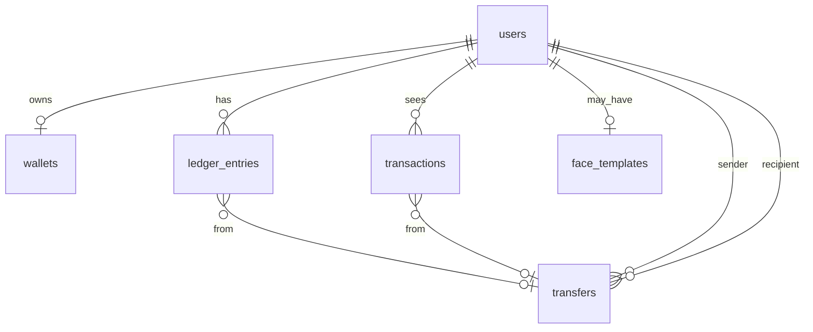

# FacePay Backend Plan

This document complements [`frontend-plan.md`](./frontend-plan.md). It records **R&D decisions**, the **chosen tech stack**, and how the API will align with the existing frontend (`features/*/api/*`, Redux shapes, and `shared/services/api.ts`).

---

## 1. Goals

| Goal | Detail |
|------|--------|
| **Replace mocks** | Move source of truth from browser `localStorage` to a server + database. |
| **Match frontend contracts** | Same DTOs as today’s TypeScript types where possible (`auth.types.ts`, `wallet.types.ts`, etc.). |
| **Auth for SPA** | Bearer JWT (already assumed in [`frontend/src/shared/services/api.ts`](../frontend/src/shared/services/api.ts) via `Authorization: Bearer` + `fp_token` in `localStorage`). |
| **HTTPS** | Required for production; camera flows already run client-side on Vercel. |
| **MVP scope** | Demo wallet + ledger-style transfers + user directory + face template storage — **not** bank rails or PCI DSS scope. |

---

## 2. Tech stack (decision)

### 2.1 Primary recommendation

| Layer | Choice | Rationale |
|-------|--------|-----------|
| **Runtime** | **Node.js 22 LTS** (or **20 LTS** until 22 is default on host) | Same language ecosystem as the React app; large hiring/tooling surface. |
| **Language** | **TypeScript (strict)** | Matches frontend; shared validation patterns with Zod. |
| **HTTP framework** | **Express.js** (current **5.x** stable line, or **4.x** if you prefer maximum ecosystem inertia) | Team preference; largest middleware ecosystem; matches common tutorials and hiring market; pairs cleanly with Prisma + Zod. |
| **ORM / migrations** | **Prisma 6** + **PostgreSQL 16+** | Declarative schema, migrations in repo, great DX for relational wallet/ledger data. |
| **Validation** | **Zod** | Request/response validation; can generate OpenAPI later for the team. |
| **Auth** | **JWT access tokens** (short TTL, e.g. 15m) + **opaque refresh tokens** stored in DB (hashed), delivered via **httpOnly Secure cookie** *or* second endpoint returning refresh in body for MVP — **start with access JWT only** to match current frontend, add refresh in Phase 2. | Aligns with existing `Bearer` + `fp_token`; upgrade path to refresh without breaking SPA. |
| **Password hashing** | **Argon2id** (`@node-rs/argon2` or `argon2`) | Modern default over bcrypt for new systems. |
| **ID style** | **UUID v7** or **CUID2** for public IDs | Avoid sequential int leakage; `txn_*` / `usr_*` prefixes can remain in API responses for readability. |
| **API style** | **REST JSON** under `/api/v1` | Matches Axios usage; easy to document in OpenAPI. |
| **Real-time** | **Not in MVP** | No WebSocket until notifications or live balance are required. |
| **Jobs / cron** | **Optional: BullMQ + Redis** later | For statement emails, cleanup — skip until needed. |
| **HTTP hardening** | **helmet** (security headers), **compression** (optional), **cors** | Standard Express production baseline. |
| **Observability** | **pino** + **pino-http** (request logging) + **OpenTelemetry** later | Structured logs without tying logger to a specific framework. |

**Project layout — feature-based (mirrors frontend `features/*` spirit):**

Each **feature** is a self-contained folder under `src/features/<name>/` with **router**, **service**, and **model** as the baseline; add other files only when the feature needs them.

```
backend/
  src/
    features/
      auth/
        auth.router.ts       # Express Router: HTTP map only (paths, verbs, middleware chain)
        auth.service.ts      # Business logic: signup, login, token issuance, password verify
        auth.model.ts        # Zod schemas + inferred TS types (LoginBody, SignupBody, AuthUserDTO)
        # optional later: auth.repository.ts — only if Prisma calls deserve isolation from service

      users/                 # directory search, “me” profile fields (aligns with send recipient search + profile)
        users.router.ts
        users.service.ts
        users.model.ts

      wallet/
        wallet.router.ts
        wallet.service.ts
        wallet.model.ts

      transfers/             # idempotent POST send (aligns with send flow + wallet debit)
        transfers.router.ts
        transfers.service.ts
        transfers.model.ts

      transactions/        # list/filter history (aligns with home + history screens)
        transactions.router.ts
        transactions.service.ts
        transactions.model.ts

      face/                  # face template CRUD (aligns with faceAuth)
        face.router.ts
        face.service.ts
        face.model.ts

      profile/               # security summary / health (aligns with profile screen); optional merge into users
        profile.router.ts
        profile.service.ts
        profile.model.ts

    shared/                  # cross-cutting, not a business feature
      middleware/          # requireAuth, errorHandler, rateLimit presets
      lib/                   # prisma singleton, env.ts, logger
      types/                 # truly global types (e.g. AuthenticatedRequest) if needed

    app.ts                   # express(), helmet, cors, mount feature routers under /api/v1
    server.ts                # HTTP listen

  prisma/
    schema.prisma            # tables per §6 (User, Wallet, LedgerEntry, …); not duplicated per feature folders
    seed.ts                  # `npx prisma db seed` — demo users, ledger, tx rows (see §9)

  package.json
  Dockerfile                 # multi-stage image (see §8.1)
  docker-compose.yml         # local Postgres + API (see §8.1)
  .dockerignore              # shrink build context; exclude node_modules, dist, .env
  .env.example               # documented env vars for local dev / Compose
```

### 2.2 Feature layout — per-file roles

| File | Responsibility |
|------|------------------|
| **`<name>.router.ts`** | Defines `Router()`, wires `GET/POST/…`, attaches feature-specific middleware (e.g. `requireAuth`), parses input (often via Zod from model), calls **service**, maps results/errors to HTTP status + JSON. Keep thin. |
| **`<name>.service.ts`** | Business rules, orchestration, transactions (DB transaction boundaries). Calls Prisma **directly** or via a **repository** file if the service grows large. |
| **`<name>.model.ts`** | **API contract + validation**: Zod schemas for request bodies/query params and DTO shapes returned to clients. Export inferred TypeScript types. *Not* the Prisma schema file — DB models live in `prisma/schema.prisma`. |

**Optional (add only when needed):**

| File | When |
|------|------|
| **`<name>.repository.ts`** | Many Prisma queries or complex SQL; you want services testable without touching query details. |
| **`<name>.controller.ts`** | Team prefers router → controller → service (same as fat handlers split out). |
| **`<name>.constants.ts`** | Magic strings, limits, error codes for this feature only. |

**Mounting routers:** `app.ts` imports each feature’s router and does `app.use("/api/v1/auth", authRouter)` (or nest routers so paths stay inside each `*.router.ts`).

**Naming alignment with frontend:** `auth`, `face`, `wallet`, `send` (→ **transfers** + **users** search), `history` (→ **transactions**), `receive` (QR payload uses **users** public id), `profile` (→ **profile** or **users**) — same mental map when swapping mock `api/*.ts` for HTTP calls.

---

**Core npm packages (Express stack):**

- `express`, `cors`, `helmet`, `express-rate-limit`  
- `jsonwebtoken` or `jose` (JWT sign/verify)  
- `zod` (+ optional `zod-express-middleware` or manual parse per route)  
- `@prisma/client`, `prisma` (dev)  
- `argon2` (password hashing)  
- `pino`, `pino-http`  

---

### 2.3 Alternatives considered (brainstorm)

| Alternative | When it wins | Why we did not pick it as default |
|-------------|--------------|-----------------------------------|
| **Fastify** + Prisma | Higher default throughput, built-in JSON schema validation | Not chosen — **Express** preferred for this project. |
| **NestJS** + Prisma | Larger team, decorators, built-in DI, CQRS later | More boilerplate for a first MVP; optional migration path if the app grows into many modules. |
| **Hono** + Drizzle | Edge deploy (Cloudflare Workers), minimal cold start | Prisma on edge is still awkward; FacePay API is traditional Node + Postgres. |
| **Python FastAPI** | ML-heavy server-side face in future | Introduces second language; fine for a **rewrite** of a face microservice later, not for core CRUD MVP. |
| **MongoDB** | Rapid schema change | Wallet + transfers are inherently relational (ledger, constraints); Postgres is a better fit. |
| **tRPC** | End-to-end types with monorepo | Frontend already uses REST + Redux thunks; tRPC would require a larger frontend refactor. |
| **Supabase (BaaS)** | Fastest time to auth + DB | Less control over transfer idempotency and custom ledger logic; viable **alternative MVP** if you want managed auth+DB only. |

---

## 3. Face + security model (backend alignment)

The frontend ([`frontend-plan.md`](./frontend-plan.md)) runs **@vladmandic/face-api** in the browser: detection, descriptor comparison, and **EAR blink liveness** are client-side today.

| Decision | MVP approach |
|----------|----------------|
| **Enrollment** | `PUT /api/v1/me/face-template` accepts **face descriptor** (`number[]` as in [`SaveDescriptorRequest`](../frontend/src/features/faceAuth/types/face.types.ts)); **user id from JWT only**; store **encrypted at rest** (application-level encryption with KMS or env-derived key for MVP). |
| **Verification** | Client performs match + blink; server **does not** see video in MVP. For payments, server validates **JWT**, **balance**, **idempotency**, and optionally **step-up**: e.g. require recent `POST /api/v1/me/face-verify-session` with signed **challenge** or server-issued nonce (Phase 1.5 — R&D). |
| **Disclaimer** | Document that MVP is **not** bank-grade face anti-spoofing on the server; product copy should match. |

---

## 4. Frontend ↔ backend mapping

Derived from [`frontend-plan.md`](./frontend-plan.md) and current mock APIs under `frontend/src/features/*/api/`. **Normative HTTP detail** (methods, paths, bodies, status codes) is in **§5**.

### 4.1 Auth (`features/auth`)

| Frontend today | Backend target |
|----------------|----------------|
| `loginApi({ mobile, password })` → `{ user, token }` | `POST /api/v1/auth/login` |
| `signupApi({ name, mobile, email, password })` | `POST /api/v1/auth/signup` |
| `logoutApi()` | `POST /api/v1/auth/logout` (invalidate refresh if added) |
| `User`: `id`, `name`, `mobile`, `email`, optional `avatar` | Same JSON shape; `password` never returned. |

**Client:** [`api.ts`](../frontend/src/shared/services/api.ts) attaches `Bearer` from `fp_token`. Backend should issue JWT with `sub` = user id and validate on protected routes.

**Env alignment:** Frontend uses `import.meta.env.VITE_API_URL || "/api"`. [`frontend/.env.example`](../frontend/.env.example) documents **`VITE_API_URL`** (full API origin including path prefix if used).

---

### 4.2 Face (`features/faceAuth`)

| Frontend today | Backend target |
|----------------|----------------|
| `saveFaceDescriptor({ userId, descriptor })` | `PUT /api/v1/me/face-template` (userId from JWT only — **ignore** client `userId` for security) |
| `getFaceDescriptor(userId)` | `GET /api/v1/me/face-template` |
| `deleteFaceDescriptor()` | `DELETE /api/v1/me/face-template` |

Store descriptor as **JSON array** or **bytea** (normalized float array). Encrypt at rest in MVP minimum.

---

### 4.3 Wallet (`features/wallet`)

| Frontend today | Backend target |
|----------------|----------------|
| `fetchBalance()` → `number` | `GET /api/v1/me/wallet/balance` |
| `addFunds({ amount })` | `POST /api/v1/me/wallet/add-funds` (demo-only or admin-flagged in prod) |
| P2P debit | **`POST /api/v1/transfers`** only (`features/send/api/sendApi.ts` + thunks); wallet feature does not expose a separate transfer mock. |

---

### 4.4 Send + transactions (`features/send`, `home`, `history`)

| Frontend today | Backend target |
|----------------|----------------|
| `searchRecipients(query)` | `GET /api/v1/users?search=` (paginate later) |
| `submitTransfer(recipientId, amount, note?)` | `POST /api/v1/transfers` with body `{ recipientId, amount, note?, idempotencyKey }` |
| Home/history transaction rows | `GET /api/v1/me/transactions?direction=&cursor=` |

**Data model note:** Implement **ledger** (append-only entries) + materialized `balance` or sum-on-read for MVP simplicity. Enables history, audits, and idempotent transfers.

---

### 4.5 Receive / QR (`features/receive`)

| Frontend today | Backend target |
|----------------|----------------|
| QR payload JSON `{ userId, name, mobile }` | Keep compatible payload; `userId` must be **server-issued public id**. Optional later: signed QR with expiry (`paymentRequestId`). |

---

### 4.6 Profile (`features/profile`)

| Frontend today | Backend target |
|----------------|----------------|
| `fetchSecurityHealth()` (reads `fp_face_descriptor` in mock) | `GET /api/v1/me/security-summary` — server derives `faceRegistered`, score rules, etc. |

---

## 5. HTTP API specification

Base path: **`/api/v1`**. All JSON bodies use **`Content-Type: application/json`**. Unless noted, responses use the **error envelope** on failure: `{ "code": "SNAKE_CASE", "message": "Human-readable text", "details": {} }`.

**Money in JSON (MVP):** Request/response fields named **`amount`** / **`balance`** / **`newBalance`** are in **INR rupees** as a **number** (aligned with current frontend: wallet/send/home types). The server converts to **integer paise** for §6 persistence (`round` half-up from 2 decimal places; reject >2 dp).

**Auth:** After login/signup, send **`Authorization: Bearer <access_token>`** on protected routes (matches [`frontend/src/shared/services/api.ts`](../frontend/src/shared/services/api.ts) using `fp_token`).

**JWT access token (MVP):** Access payload includes **`sub`** = `users.id` (string), **`iat`**, **`exp`** (Unix seconds). Optional **`mobile`** for debugging/support only — **never** use for authorization decisions. When verifying **`exp`**, allow a small clock skew (e.g. **±60 seconds**) so minor client/server drift does not cause spurious `401`.

**Pagination cursor encoding:** **`cursor`** / **`nextCursor`** are opaque to clients. Implementation: **base64url**-encode a stable tuple such as JSON `{"t":"ISO8601","id":"uuid"}` (sort key = `(created_at, id)`); return **`nextCursor`: `null`** when no further page.

**`SecurityHealth.emailVerified`:** `true` iff `users.email_verified_at` is set; otherwise `false` until the product adds email verification.

**`POST /transfers` idempotent status:** First successful create → **`201 Created`** with [`TransferResponse`](../frontend/src/features/send/types/send.types.ts). Replay of the same sender + **`Idempotency-Key`** → **`200 OK`** with the **same** response body and **no** duplicate ledger movement.

---

### 5.1 Conventions

| Item | Rule |
|------|------|
| **Methods** | Use `GET`, `POST`, `PUT`, `DELETE` idiomatically; `POST` for non-idempotent actions. |
| **Success** | `2xx` with JSON body; `204` only when no body (e.g. delete face template). |
| **Client errors** | `400` validation, `401` unauthenticated, `403` forbidden, `404` missing resource, `409` conflict (e.g. duplicate mobile on signup). |
| **Business errors** | `402` optional for insufficient funds (or `400` + stable `code`); document one approach and stick to it. |
| **Idempotency** | `POST /transfers` requires header **`Idempotency-Key`** (string, ≤128 chars); same sender + key replays same `201`/`200` response without double-charging (see §6.4). |
| **Pagination** | `GET` list endpoints: `limit` (default 20, max 100), `cursor` (opaque) optional; response `{ "items": [...], "nextCursor": "..." \| null }`. |
| **CORS** | Allow Vercel origin + local dev (see §7). |

---

### 5.2 Public routes

| Method | Path | Auth | Request | Response | Notes |
|--------|------|------|---------|----------|--------|
| **GET** | `/health` | No | — | `{ "status": "ok" }` | Liveness; can live **outside** `/api/v1` on same host if preferred. |
| **POST** | `/api/v1/auth/signup` | No | **Body:** `{ "name": string, "mobile": string, "email": string, "password": string }` — same as [`SignupRequest`](../frontend/src/features/auth/types/auth.types.ts) | **`201`** `{ "user": User, "token": string }` — `User`: `id`, `name`, `mobile`, `email`, optional `avatar` | `409` if mobile or email already registered. |
| **POST** | `/api/v1/auth/login` | No | **Body:** `{ "mobile": string, "password": string }` — [`LoginRequest`](../frontend/src/features/auth/types/auth.types.ts) | **`200`** `{ "user": User, "token": string }` — same as [`AuthResponse`](../frontend/src/features/auth/types/auth.types.ts) | `401` invalid credentials. |

---

### 5.3 Auth (protected)

| Method | Path | Auth | Request | Response | Notes |
|--------|------|------|---------|----------|--------|
| **POST** | `/api/v1/auth/logout` | Bearer | Empty body or `{}` | **`204`** no body | Invalidate refresh/session if implemented later. Client still clears `fp_token`. |

---

### 5.4 Current user & profile

| Method | Path | Auth | Request | Response | Notes |
|--------|------|------|---------|----------|--------|
| **GET** | `/api/v1/me` | Bearer | — | **`200`** `{ "id", "name", "mobile", "email", "avatar?", "joinedAt": ISO8601, "faceRegistered": boolean }` | Superset for [`User`](../frontend/src/features/auth/types/auth.types.ts) + [`ProfileData`](../frontend/src/features/profile/types/profile.types.ts) fields `joinedDate` / `faceRegistered` (map `joinedAt` ↔ `joinedDate` in frontend when wiring). |
| **GET** | `/api/v1/me/security-summary` | Bearer | — | **`200`** [`SecurityHealth`](../frontend/src/features/profile/types/profile.types.ts): `{ "score", "faceRegistered", "emailVerified", "pinEnabled" }` | Replaces mock `fetchSecurityHealth()`. |

---

### 5.5 Wallet

| Method | Path | Auth | Request | Response | Notes |
|--------|------|------|---------|----------|--------|
| **GET** | `/api/v1/me/wallet/balance` | Bearer | — | **`200`** `{ "balance": number }` (rupees) | Matches `fetchBalance()`. |
| **POST** | `/api/v1/me/wallet/add-funds` | Bearer | **Body:** `{ "amount": number }` — [`AddFundsRequest`](../frontend/src/features/wallet/types/wallet.types.ts) | **`200`** `{ "newBalance": number, "timestamp": string }` — [`AddFundsResult`](../frontend/src/features/wallet/types/wallet.types.ts) | Demo / admin-flag only in prod; creates ledger `top_up`. |

---

### 5.6 Users directory & receive (QR)

| Method | Path | Auth | Request | Response | Notes |
|--------|------|------|---------|----------|--------|
| **GET** | `/api/v1/users` | Bearer | **Query:** `search` (string, optional), `limit`, `cursor` | **`200`** `{ "items": Recipient[] }` — [`Recipient`](../frontend/src/features/send/types/send.types.ts): `id`, `name`, `mobile`, optional `avatar` | Replaces `searchRecipients(query)`; empty `search` returns directory default list. |
| **GET** | `/api/v1/users/:userId` | Bearer | — | **`200`** same as `Recipient` + optional extra fields for review screen | Validate payee exists before transfer; `404` if unknown. |
| **GET** | `/api/v1/me/receive-qr` | Bearer | — | **`200`** [`QRData`](../frontend/src/features/receive/types/receive.types.ts): `{ "userId", "name", "mobile" }` | Stable payload for `qrcode.react`; `userId` is server `users.id`. |

---

### 5.7 Transfers (send money)

| Method | Path | Auth | Request | Response | Notes |
|--------|------|------|---------|----------|--------|
| **POST** | `/api/v1/transfers` | Bearer | **Headers:** `Idempotency-Key: <string>` (required). **Body:** `{ "recipientId": string, "amount": number, "note"?: string }` — same shape as `submitTransferThunk` payload in [`sendThunks.ts`](../frontend/src/features/send/state/sendThunks.ts) | **`201`** / idempotent replay **`200`** — [`TransferResponse`](../frontend/src/features/send/types/send.types.ts): `{ "transactionId", "amount", "recipientId", "timestamp", "newBalance" }` | Atomically: create `transfers` row, ledger lines, `transactions` rows, update wallets (§6). `400` validation; insufficient funds use chosen `402` or `400` + `code`. **Self-transfer:** `400` + stable `code` if `recipientId` equals JWT `sub`. |

`transactionId` in the response = transfer id (UUID string) for receipt UI.

---

### 5.8 Transactions (home & history)

| Method | Path | Auth | Request | Response | Notes |
|--------|------|------|---------|----------|--------|
| **GET** | `/api/v1/me/transactions` | Bearer | **Query:** `direction` optional (`sent` \| `received`), `search` optional (substring on title), `limit`, `cursor` | **`200`** `{ "items": Transaction[], "nextCursor": string \| null }` — [`Transaction`](../frontend/src/features/history/types/history.types.ts): `id`, `direction`, `title`, `subtitle`, `amount`, `timestamp`, `icon`, optional `note` | Replaces `fetchTransactions()` + home recent list (`limit=5` for dashboard). Client-side date grouping stays in UI. |

---

### 5.9 Face template (enrollment)

| Method | Path | Auth | Request | Response | Notes |
|--------|------|------|---------|----------|--------|
| **PUT** | `/api/v1/me/face-template` | Bearer | **Body:** `{ "descriptor": number[] }` — **omit** `userId` from contract (ignore if sent); server binds JWT only | **`200`** `{ "success": true }` — [`SaveDescriptorResponse`](../frontend/src/features/faceAuth/types/face.types.ts) | Store encrypted (§3, §6.6). |
| **GET** | `/api/v1/me/face-template` | Bearer | — | **`200`** `{ "descriptor": number[] \| null }` — [`GetDescriptorResponse`](../frontend/src/features/faceAuth/types/face.types.ts) | For client re-verification flow if needed. |
| **DELETE** | `/api/v1/me/face-template` | Bearer | — | **`204`** | |

---

### 5.10 Summary checklist (frontend feature → routes)

| Frontend feature | Routes |
|------------------|--------|
| `auth` | `POST .../auth/signup`, `POST .../auth/login`, `POST .../auth/logout` |
| `home` | `GET .../me/transactions?limit=5` (or full list + slice client-side) |
| `wallet` | `GET .../me/wallet/balance`, `POST .../me/wallet/add-funds` |
| `send` | `GET .../users`, `GET .../users/:id`, `POST .../transfers` |
| `history` | `GET .../me/transactions` |
| `receive` | `GET .../me/receive-qr` (+ scanned `userId` resolves via `GET .../users/:id`) |
| `profile` | `GET .../me`, `GET .../me/security-summary` |
| `faceAuth` | `PUT|GET|DELETE .../me/face-template` |

**Not an HTTP route:** face **verification** (camera + blink) stays in the browser for MVP; the server trusts **authenticated** `POST /transfers` after your product rules (optional future: `POST .../me/face-verify-session` step-up — see §3).

---

## 6. Database schema (planned tables)

Planned for **PostgreSQL** via **Prisma** (`prisma/schema.prisma`). Types follow Postgres; amounts in **paise** (`BIGINT`) to avoid floating-point money errors (INR). Adjust naming to match Prisma models when you implement.

**Conventions:** `id` = UUID PK (`gen_random_uuid()` or app-generated CUID2); `created_at` / `updated_at` = `TIMESTAMPTZ` where shown; unique constraints as noted.

### 6.1 `users`

| Column | Type | Constraints | Notes |
|--------|------|-------------|--------|
| `id` | UUID | PK | Exposed as `user.id` in API (string). |
| `mobile` | VARCHAR(20) | UNIQUE, NOT NULL | Store normalized digits (e.g. `9876543210`). |
| `email` | VARCHAR(255) | UNIQUE, NOT NULL | Lowercase normalized. |
| `name` | VARCHAR(120) | NOT NULL | Display name. |
| `password_hash` | TEXT | NOT NULL | Argon2id string; never returned by API. |
| `avatar_url` | TEXT | NULL | Optional profile image URL. |
| `created_at` | TIMESTAMPTZ | NOT NULL, default now() | |
| `updated_at` | TIMESTAMPTZ | NOT NULL, default now() | Update on write. |

Indexes: `(mobile)`, `(email)` — already unique.

---

### 6.2 `wallets`

One row per user; **cached balance** updated in the same DB transaction as `ledger_entries` + `transfers` commits.

| Column | Type | Constraints | Notes |
|--------|------|-------------|--------|
| `id` | UUID | PK | |
| `user_id` | UUID | UNIQUE, NOT NULL, FK → `users.id` ON DELETE CASCADE | |
| `balance_cents` | BIGINT | NOT NULL, default 0 | Cached; must match ledger invariant. |
| `currency` | CHAR(3) | NOT NULL, default `'INR'` | |
| `updated_at` | TIMESTAMPTZ | NOT NULL, default now() | |

---

### 6.3 `ledger_entries` (append-only)

Source of truth for money movement for a **single user’s** wallet perspective (signed `change_cents`: credit +, debit −).

| Column | Type | Constraints | Notes |
|--------|------|-------------|--------|
| `id` | UUID | PK | |
| `user_id` | UUID | NOT NULL, FK → `users.id` | Wallet owner for this line. |
| `change_cents` | BIGINT | NOT NULL | Positive = credit, negative = debit. |
| `balance_after_cents` | BIGINT | NOT NULL | Running balance snapshot after this line. |
| `entry_type` | VARCHAR(32) | NOT NULL | e.g. `transfer_out`, `transfer_in`, `top_up`, `adjustment`. |
| `transfer_id` | UUID | NULL, FK → `transfers.id` | Set when row comes from a P2P transfer. |
| `metadata` | JSONB | NULL | Extra audit fields (e.g. idempotency key copy). |
| `created_at` | TIMESTAMPTZ | NOT NULL, default now() | Immutable. |

Indexes: `(user_id, created_at DESC)` for history replay; `(transfer_id)` optional.

---

### 6.4 `transfers`

P2P send; **idempotent** via `idempotency_key` (same sender + key = same logical transfer).

| Column | Type | Constraints | Notes |
|--------|------|-------------|--------|
| `id` | UUID | PK | Maps to `transactionId` in API responses. |
| `idempotency_key` | VARCHAR(128) | NOT NULL | With `sender_user_id` forms UNIQUE composite. |
| `sender_user_id` | UUID | NOT NULL, FK → `users.id` | |
| `recipient_user_id` | UUID | NOT NULL, FK → `users.id` | |
| `amount_cents` | BIGINT | NOT NULL, CHECK > 0 | |
| `note` | VARCHAR(500) | NULL | |
| `status` | VARCHAR(24) | NOT NULL, default `'completed'` | MVP: `completed` / `failed`; add `pending` if needed. |
| `failure_code` | VARCHAR(64) | NULL | e.g. `INSUFFICIENT_FUNDS` when `failed`. |
| `created_at` | TIMESTAMPTZ | NOT NULL, default now() | |

**Unique:** `(sender_user_id, idempotency_key)`.

On success: insert **two** `ledger_entries` (debit sender, credit recipient) and **two** `transactions` rows (see §6.5) in one transaction; update `wallets.balance_cents` for both users.

---

### 6.5 `transactions` (denormalized feed)

Powers **home** + **history** lists (`RecentTransaction` shape). One row per user per “line item” (sender gets `sent`, recipient gets `received`).

| Column | Type | Constraints | Notes |
|--------|------|-------------|--------|
| `id` | UUID | PK | |
| `user_id` | UUID | NOT NULL, FK → `users.id` | Owner of this feed row. |
| `direction` | VARCHAR(16) | NOT NULL | `sent` \| `received`. |
| `title` | VARCHAR(200) | NOT NULL | e.g. “Sent to Rohan Sharma”. |
| `subtitle` | VARCHAR(200) | NOT NULL | e.g. “Just now” / relative time copy. |
| `amount_cents` | BIGINT | NOT NULL | Always positive in UI. |
| `peer_user_id` | UUID | NULL, FK → `users.id` | Counterparty. |
| `transfer_id` | UUID | NULL, FK → `transfers.id` | |
| `icon` | VARCHAR(64) | NULL | Material icon name, e.g. `call_made`. |
| `note` | VARCHAR(500) | NULL | User note on send. |
| `created_at` | TIMESTAMPTZ | NOT NULL, default now() | Sort / “Today” grouping. |

Indexes: `(user_id, created_at DESC)`; optional `(direction)`.

---

### 6.6 `face_templates`

Stores **encrypted** face descriptor / template for enrolled user (see §3).

| Column | Type | Constraints | Notes |
|--------|------|-------------|--------|
| `user_id` | UUID | PK, FK → `users.id` ON DELETE CASCADE | One template per user in MVP. |
| `ciphertext` | BYTEA or TEXT | NOT NULL | Encrypted payload (app-level key from env). |
| `algorithm_version` | VARCHAR(32) | NOT NULL | e.g. `face-api-v1` for future migrations. |
| `created_at` | TIMESTAMPTZ | NOT NULL, default now() | |
| `updated_at` | TIMESTAMPTZ | NOT NULL, default now() | |

---

### 6.7 Optional later (not required for MVP)

| Table | Purpose |
|-------|---------|
| `refresh_tokens` | Hashed refresh token, `user_id`, `expires_at`, revoked flag — if you add refresh-token auth. |
| `audit_logs` | Security-sensitive actions. |

### 6.8 Entity overview (Mermaid)



---

## 7. Non-functional requirements

| Topic | Choice |
|-------|--------|
| **CORS** | Allow `https://facepay-bice.vercel.app` + localhost dev origins. |
| **Rate limiting** | `express-rate-limit` (global + stricter limiter on `/api/v1/auth/login`). |
| **Idempotency** | `Idempotency-Key` header on `POST /transfers`. |
| **Errors** | JSON `{ "code": "INSUFFICIENT_FUNDS", "message": "..." }` with stable `code` for i18n later. |

---

## 8. Deployment (suggested)

| Piece | Suggestion |
|-------|------------|
| **API + Postgres** | Railway, Render, Fly.io, or Neon (Postgres) + small Node process. |
| **Migrations** | `prisma migrate deploy` in release phase (after Prisma is added to `backend/`). |
| **Secrets** | `DATABASE_URL`, `JWT_SECRET`, `FACE_TEMPLATE_ENCRYPTION_KEY` in host env — never in repo. |

Frontend remains on **Vercel**; API on a subdomain **`api.*`** with HTTPS.

### 8.1 Docker (when `backend/` is scaffolded)

No `backend/` implementation lives in the repo until you start **Phase B0**; add Docker **with** the first API scaffold so local and CI behave the same.

| File (under `backend/`) | Purpose |
|-------------------------|---------|
| **`Dockerfile`** | **Multi-stage:** install deps → `npm run build` (TypeScript → `dist/`) → slim image with `npm ci --omit=dev`, non-root user, `CMD node dist/server.js`. |
| **`docker-compose.yml`** | **Local stack:** `postgres` (16 Alpine, named volume) + `api` service building from the Dockerfile. Use a **Postgres healthcheck** and `depends_on: condition: service_healthy`. Map e.g. host **4000** → container **3000**. |
| **`.dockerignore`** | Exclude `node_modules`, `dist`, `.env`, `.git` from the build context. |
| **`.env.example`** | Document `PORT`, `DATABASE_URL`, `JWT_SECRET`, encryption keys; copy to `.env` for local `npm run dev` without Compose if desired. |

**Example commands** (after the folder exists)

```bash
docker compose -f backend/docker-compose.yml up --build
# or: cd backend && docker compose up --build
```

**When Prisma is added**

1. `COPY prisma ./prisma` in the Dockerfile **build** stage.  
2. Run `npx prisma generate` before `npm run build` (or via `postinstall`).  
3. Run migrations on deploy (`prisma migrate deploy` in entrypoint or release job).

**Production:** push the image to a registry; set `DATABASE_URL` to managed Postgres (Neon, RDS, etc.) instead of the compose `postgres` service.

---

## 9. Database seeding (dev & demo)

Populate Postgres with **repeatable demo data** so local dev, Docker, and QA match what the frontend expects (balances, history, recipient directory). **Never** run destructive demo seeds against production.

### 9.1 What to seed (MVP)

| Data | Purpose |
|------|---------|
| **Demo users** (2–5 rows) | Login/signup flows; vary `name` / `mobile` / `email`. |
| **Password hashes** | Argon2id of a **known dev-only** password (e.g. `demo123`) — document in README for teammates only. |
| **Wallet / ledger** | Opening balance per user + a few **ledger entries** (credit/debit) so `GET balance` and transaction math are realistic. |
| **Transactions** | Several **completed** rows (`sent` / `received`) aligned with frontend `RecentTransaction` / history shape (`direction`, `amount`, `title`, `subtitle`, `timestamp`, `icon` optional). |
| **Directory / recipients** | Extra user rows (or a `contacts`/`user_directory` table if you split “payable peers” from auth users) for **recipient search** — mirror today’s mock names/mobiles if useful. |
| **Face templates** | **Optional** in seed — skip until B4; if needed, omit or use a clearly fake encrypted payload for one user only. |

### 9.2 How (Prisma)

1. Add **`prisma/seed.ts`** (TypeScript) using `@prisma/client`.  
2. Prefer **`upsert`** or **stable primary keys** so `npx prisma db seed` is **idempotent** (safe to run multiple times).  
3. In **`package.json`**:  
   `"prisma": { "seed": "tsx prisma/seed.ts" }`  
   (adjust runner: `node --import tsx`, etc., to match the repo.)  
4. Workflow: **`prisma migrate dev`** (or `deploy`) → **`prisma db seed`**.  
5. Optional **`npm run db:reset`** for dev: `migrate reset` + seed (document that it **wipes** the local DB).

### 9.3 Docker & CI

- **Local Compose:** run seed **manually** after `up` (`docker compose exec api npx prisma db seed`) *or* a **dev-only** entrypoint that runs `migrate deploy && db seed` once — avoid auto-wiping shared databases.  
- **CI / e2e:** run migrations + seed in the job so tests see a fixed dataset; use a **throwaway** Postgres service.

### 9.4 Production

- **No** automatic seed of fake users with shared passwords.  
- Use **migrations** only, or a controlled **admin onboarding** / import pipeline.

---

## 10. Implementation phases (backend)

1. **Phase B0** — Create `backend/` repo scaffold: Express + Prisma + Postgres + **HTTP routes per §5** + **`prisma/schema.prisma` per §6** + `src/features/` + `src/shared/` + health route + mount empty routers + global middleware (`helmet`, `cors`, `pino-http`) + **Dockerfile + docker-compose** (see §8.1) + **`prisma/seed.ts`** and `"prisma": { "seed": "..." }` in `package.json` (see §9). OpenAPI stub (optional).  
2. **Phase B1** — Auth: signup, login, JWT, user row.  
3. **Phase B2** — Wallet + ledger + transactions list.  
4. **Phase B3** — Transfers + recipient search + idempotency.  
5. **Phase B4** — Face template encrypt/store + security summary endpoint.  
6. **Phase B5** — Swap frontend `features/*/api/*` to Axios `shared/services/api.ts` + env URL.

---

## 11. Pre-development audit (frontend alignment & gaps)

Cross-check against `frontend/src/**` (mock APIs, types, thunks, screens) before writing backend routes.

### 11.1 Gaps in the written plan (add during implementation)

| Gap | Action |
|-----|--------|
| **JWT claims** | **Normative:** §5 paragraph *JWT access token (MVP)* — `sub`, `iat`, `exp`; optional `mobile` debug-only. |
| **Clock skew** | **Normative:** §5 — recommend ±60s grace when validating `exp`. |
| **Avatar upload** | `User.avatar` is optional URL only in MVP — no multipart upload spec yet; add later or use external URL field. |
| **Email verification** | **Normative:** §5 — `emailVerified` ↔ `users.email_verified_at` (see *SecurityHealth.emailVerified*). |
| **Pagination cursors** | **Normative:** §5 — base64url stable tuple encoding for `GET /me/transactions` and `GET /users`. |
| **OpenAPI / Postman** | Export from implemented routes for QA (optional Phase B0/B5). |

### 11.2 Frontend ↔ API alignment (verified)

| Area | Frontend | Backend plan (§5) | Status |
|------|----------|-------------------|--------|
| Auth body / response | `LoginRequest`, `SignupRequest`, `AuthResponse` | `POST .../login`, `/signup` | Match |
| Bearer token | `api.ts` reads `localStorage` key **`fp_token`** | Issue JWT on login/signup; client unchanged if still writing `fp_token` | Match |
| Balance / add funds | `fetchBalance`, `AddFundsRequest` / `AddFundsResult` | `GET/POST .../me/wallet/*` | Match |
| Send transfer | `submitTransferThunk` + per-attempt **`Idempotency-Key`** (`crypto.randomUUID()` in thunk) | `POST .../transfers` + body + header | Match; self-transfer rejected client-side (`sub` vs `recipientId`) pending server `400` |
| Transfer response | `TransferResponse` | Same field names | Match |
| Recipients | `Recipient`, `searchRecipients` | `GET /users?search=` | Match |
| History / home rows | `Transaction` / `RecentTransaction` | `GET /me/transactions` items | Match; home uses `limit=5` |
| QR payload | `QRData` | `GET /me/receive-qr` | Match |
| Profile / security | `GET /me` fields + `SecurityHealth` | §5.4 | Match (`joinedAt` ↔ `joinedDate` naming when wiring) |
| Face enroll | `descriptor: number[]` | `PUT .../me/face-template` | Match (ignore client `userId`) |

### 11.3 Mismatches & doc/code fixes

| Issue | Detail | Resolution |
|-------|--------|------------|
| **`Idempotency-Key` not in frontend** | §5 requires header on `POST /transfers`. | **Done (mock):** `submitTransferThunk` generates **`crypto.randomUUID()`** per dispatch; `sendApi.submitTransfer` accepts optional key for B5 Axios wiring. |
| **Env var name** | `api.ts` uses **`VITE_API_URL`**. | **Done:** [`frontend/.env.example`](../frontend/.env.example) documents **`VITE_API_URL`**. |
| **Transfer HTTP status** | §5 says **`201 Created`** for new transfer; idempotent **replay** may return **`200`** with same body — document both. | **Normative:** §5 (*POST /transfers idempotent status*). Server implements lookup: first → `201`, replay → `200`. |
| **Amount limits** | `isValidAmount` caps at **₹1,00,000**; keypad used **999_999**. | **Done:** shared **`MAX_TRANSFER_RUPEES`** in validators; keypad uses same cap. |
| **Dual `submitTransfer`** | `walletApi` and `sendApi` both had transfer mocks. | **Done:** removed from **`walletApi`**; send path only. |

### 11.4 Edge cases (server + client)

| Edge case | Risk | Mitigation |
|-----------|------|------------|
| **Face success but transfer fails** | User could land on success after a failed debit. | **Client (done):** `unwrap()` on `submitTransferThunk`; on failure → **`/send/review`**. **Server:** idempotency allows safe retry. |
| **Navigate to success with no recipient** | Success screen without a payment. | **Client (done):** if missing recipient/amount → **`/send`** (no success route). |
| **Self-transfer** | User picks own `userId` as recipient (QR or search). | **Client (done):** thunk rejects before API. **Server:** `400` + `code` if `sender_user_id === recipient_user_id`. |
| **Concurrent spends** | Double-submit or two tabs. | **Server:** row-level lock / serializable transaction on wallet debit; **Idempotency-Key** per intent. |
| **Stale balance on send flow** | Client `send` slice balance vs server. | **Client:** refresh balance after successful transfer or trust response `newBalance` and patch Redux. |
| **401 on expired JWT** | Stale persisted **`auth`** after token cleared. | **Client (done):** `clearSession` + **`persistor.flush()`** then redirect **`/login`**. |
| **Logout while offline** | `logout` POST may fail; client already clears `fp_token`. | **Server:** idempotent logout optional; **client** clears local state regardless (`logoutThunk` **try/finally** + **`logoutThunk.rejected`** clears slice). |
| **Token duplication** | `fp_token` in `localStorage` + `auth.token` in **redux-persist** (`store.ts` whitelist). | **Client (401/logout):** keep both in sync; B5 may consolidate to one source. |
| **Decimal rupees** | UI allows 2 dp; large decimals edge cases. | **Server:** validate max 2 decimal places; store paise with half-up rounding. |
| **Internationalization** | `subtitle` on transactions is free text today (“Today, 2:45 PM”). | **API:** return ISO `created_at` always; let client format **or** return server-locale strings — pick one and document. |

### 11.5 Non-goals for first backend drop

- Real SMS OTP, bank settlement, PCI DSS, chargebacks.  
- Server-side face/video analysis (MVP remains client-side verify per §3 / §5.10).  
- Webhooks / async settlement.

---

## 12. Open decisions (R&D follow-ups)

- [ ] **Refresh tokens:** cookie vs. body for SPA — finalize before B1 ships to prod.  
- [ ] **Step-up token** after face verify for high-risk actions (optional).  
- [x] **Env:** `VITE_API_URL` documented in [`frontend/.env.example`](../frontend/.env.example) (aligned with `api.ts`).  
- [ ] **QR v2:** signed payload with TTL for “receive fixed amount” flows.  
- [x] **Frontend (pre-B5):** `FaceVerificationScreen` + keypad max + idempotency key + self-transfer + 401 session clear — see §11.3–§11.4.

---

## 13. Document history

| Date | Change |
|------|--------|
| 2026-04-10 | **§11 audit closures (frontend)** — idempotency key in send thunk, self-transfer guard, face verify navigation, `MAX_TRANSFER_RUPEES`, `clearSession` + persist flush on 401, wallet duplicate transfer mock removed, `.env.example` / §5 JWT + cursor + idempotent HTTP status text. |
| 2026-02-11 | Initial backend plan: stack decision, frontend mapping, phases. |
| 2026-02-11 | **HTTP framework set to Express.js** — middleware list, layout, phases B0 updated; Fastify moved to alternatives. |
| 2026-02-11 | **Feature-based layout** — `src/features/*` with `router` + `service` + `model` per feature; optional repository/controller; `shared/` for middleware/lib. |
| 2026-02-11 | **Docker** — `backend/Dockerfile` (multi-stage), `backend/docker-compose.yml` (Postgres + API), `.dockerignore`, `.env.example`; §8.1 + Phase B0 note. |
| 2026-02-11 | **`backend/` implementation removed** from repo until build phase; §8.1 and Phase B0 updated to “add with scaffold.” |
| 2026-02-11 | **Project layout tree** — listed `Dockerfile`, `docker-compose.yml`, `.dockerignore`, `.env.example` at `backend/` root (no `docker/` subfolder). |
| 2026-02-11 | **§9 Database seeding** — MVP seed contents, Prisma `seed.ts`, Docker/CI/production notes; Phase B0 includes seed. |
| 2026-02-11 | **§6 Database schema** — planned tables, Mermaid ER (prior §5 renumbered to §6 when API added). |
| 2026-02-11 | **§5 HTTP API specification** — methods, paths, auth, bodies, responses aligned with frontend types; money in rupees JSON + paise in DB; sections 6–12 renumbered; cross-refs (Docker §8.1, seeding §9, schema §6). |
| 2026-02-11 | **§11 Pre-development audit** — gaps, frontend↔API table, mismatches (`Idempotency-Key`, env var, keypad vs validator max), edge cases (face vs transfer success, self-transfer, 401 vs persist); Open decisions renumbered to §12, document history to §13. |
