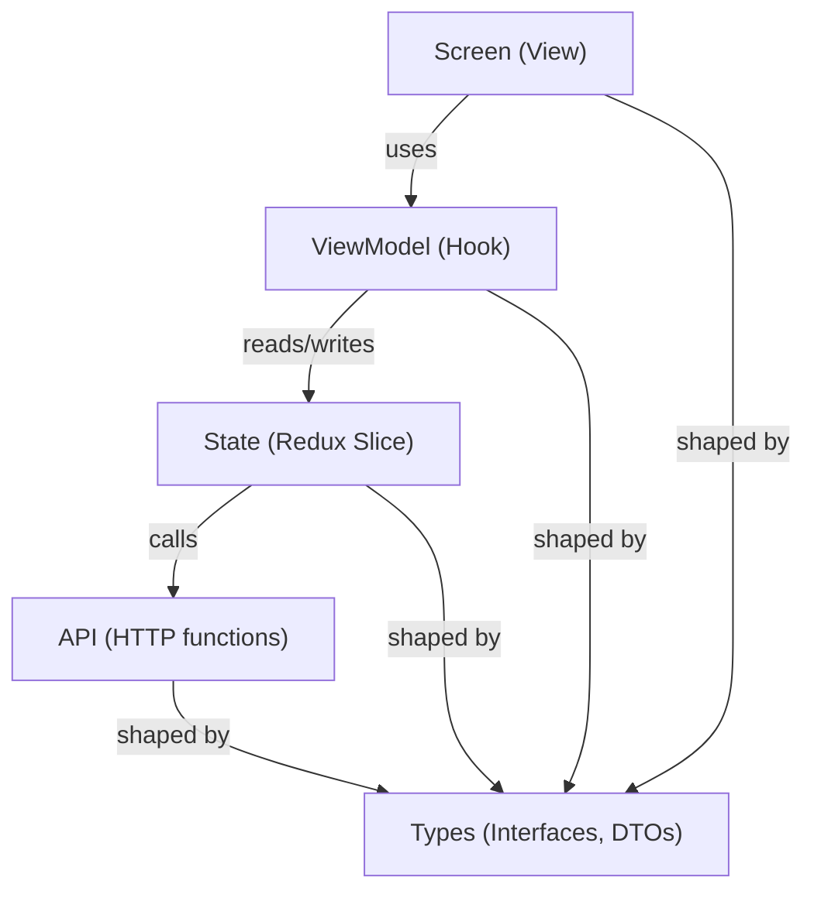
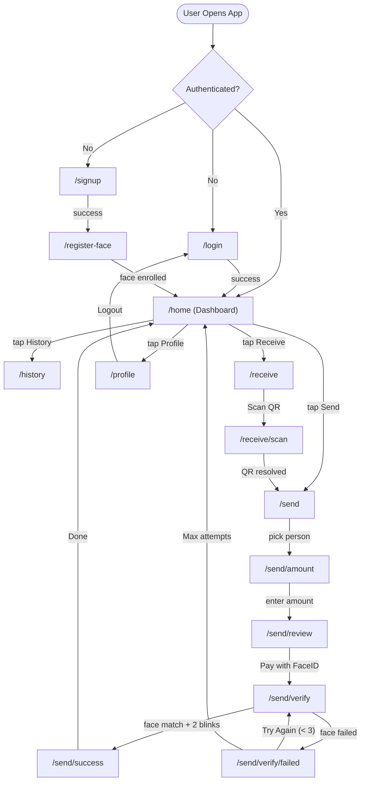
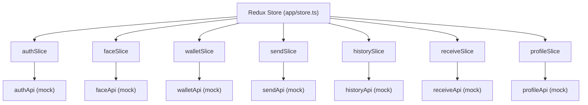
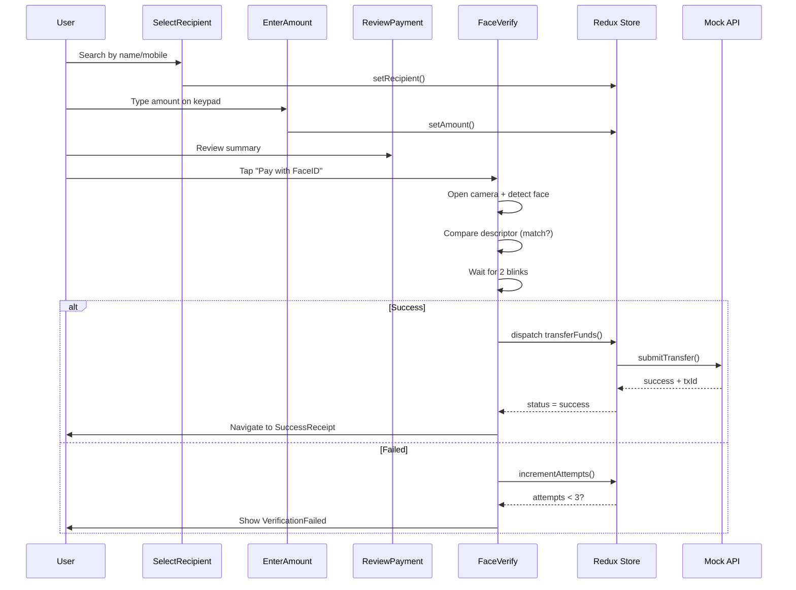
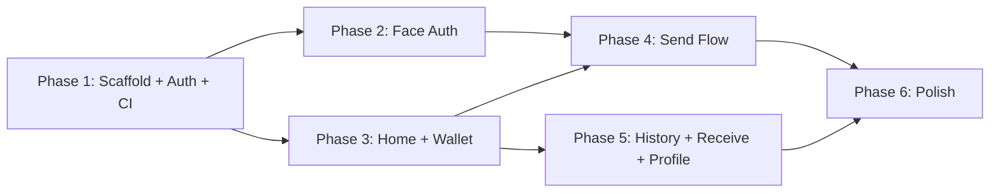
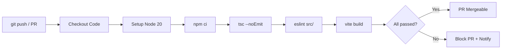
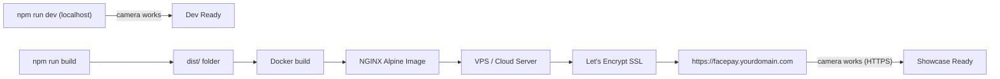

---

# FacePay Frontend Development Plan

## Tech Stack

- **React 18** + **Vite** + **TypeScript** (strict mode)
- **Tailwind CSS v3** (matches Stitch exports)
- **React Router v6** (client-side routing)
- **Redux Toolkit** (auth, wallet, transactions state)
- **@vladmandic/face-api** (maintained fork of face-api.js — face detection, recognition, landmarks + custom EAR-based blink detection)
- **Material Symbols** (icon font, same as designs)
- **Manrope + Poppins** (Google Fonts, same as designs)

## Architecture: MVVM + Feature-Based

Each feature is a self-contained folder with 6 sub-folders:

- **types/** — TypeScript interfaces, enums, DTOs for that feature
- **api/** — API call functions for that feature (isolated HTTP layer; uses mock data now, swaps to real backend later)
- **state/** — Redux slice + async thunks that call api/ functions (the **Model** layer)
- **viewModel/** — Custom hooks that select state + dispatch actions (the **ViewModel** layer — connects Model to View)
- **components/** — Reusable presentational UI pieces for that feature (part of **View**)
- **screens/** — Full page-level components that compose components + use viewModels (the **View** layer)



## Project Structure

```
frontend/
  src/
    app/
      store.ts               # Redux store config (combines all feature slices)
      rootReducer.ts          # Root reducer combining feature slices
      router.tsx              # Route definitions + auth guards
      App.tsx                 # App shell (router + providers)

    features/
      auth/
        types/
          auth.types.ts       # User, LoginRequest, SignupRequest, AuthState
        api/
          authApi.ts          # login(), signup(), logout() — mock now
        state/
          authSlice.ts        # createSlice: user, token, isAuthenticated
          authThunks.ts       # async thunks that call authApi
        viewModel/
          useAuthViewModel.ts # useAppSelector + dispatch wrappers
        components/
          AuthInput.tsx       # Styled input with icon + label
          BiometricHint.tsx   # Fingerprint/face/key decorative icons
        screens/
          LoginScreen.tsx
          SignupScreen.tsx

      faceAuth/
        types/
          face.types.ts       # FaceDescriptor, VerifyStatus, BlinkState
        api/
          faceApi.ts          # saveFaceDescriptor(), getFaceDescriptor() — mock now
        state/
          faceSlice.ts        # descriptor, verifyStatus, attempts
          faceThunks.ts       # async thunks that call faceApi
        viewModel/
          useFaceViewModel.ts # face state selectors + actions
        components/
          FaceScanner.tsx     # Camera + face-api.js overlay
          BlinkDetector.tsx   # EAR-based blink tracking UI
          ScannerRing.tsx     # Animated scanning ring + corner brackets
        screens/
          RegisterFaceScreen.tsx
          FaceVerificationScreen.tsx
          VerificationFailedScreen.tsx

      home/
        types/
          home.types.ts       # QuickAction, RecentTransaction
        api/
          homeApi.ts          # fetchDashboardData() — mock now
        state/
          homeSlice.ts        # dashboard-specific UI state if needed
        viewModel/
          useHomeViewModel.ts # combines auth + wallet + tx data for dashboard
        components/
          BalanceCard.tsx      # Hero balance card with gradient
          QuickActions.tsx     # Send/Receive/History/Add grid
          RecentTransactions.tsx
        screens/
          HomeScreen.tsx

      wallet/
        types/
          wallet.types.ts     # WalletState, TransferRequest, TransferResult
        api/
          walletApi.ts        # fetchBalance(), addFunds() — mock now
        state/
          walletSlice.ts      # balance, loading, error
          walletThunks.ts     # async thunks that call walletApi
        viewModel/
          useWalletViewModel.ts

      send/
        types/
          send.types.ts       # Recipient, AmountEntry, ReviewData
        api/
          sendApi.ts          # searchRecipients(), submitTransfer() — mock now
        state/
          sendSlice.ts        # currentTx: recipient, amount, note, status
          sendThunks.ts       # async thunks that call sendApi
        viewModel/
          useSendViewModel.ts # orchestrates send flow state
        components/
          RecipientCard.tsx    # Avatar + name + masked mobile
          AmountDisplay.tsx    # Large currency display
          NumericKeypad.tsx    # Custom 0-9 + . + backspace grid
          ReviewSummary.tsx    # Confirm card with details
        screens/
          SelectRecipientScreen.tsx
          EnterAmountScreen.tsx
          ReviewPaymentScreen.tsx
          SuccessReceiptScreen.tsx

      history/
        types/
          history.types.ts    # Transaction, TransactionFilter, DateGroup
        api/
          historyApi.ts       # fetchTransactions() — mock now
        state/
          historySlice.ts     # transactions, filter, search
          historyThunks.ts    # async thunks that call historyApi
        viewModel/
          useHistoryViewModel.ts
        components/
          TransactionRow.tsx   # Single transaction item
          FilterChips.tsx      # All / Sent / Received chips
          DateGroupHeader.tsx  # "Today", "Yesterday" headers
        screens/
          HistoryScreen.tsx

      receive/
        types/
          receive.types.ts    # QRData, ScanResult
        api/
          receiveApi.ts       # resolveQR(), generatePaymentQR() — mock now
        state/
          receiveSlice.ts     # qr generation/scan state
        viewModel/
          useReceiveViewModel.ts
        components/
          QRDisplay.tsx        # QR code + FacePay ID
          QRScanner.tsx        # Camera viewfinder + html5-qrcode
        screens/
          MyQRCodeScreen.tsx
          ScanQRScreen.tsx

      profile/
        types/
          profile.types.ts    # ProfileData, SecurityHealth, SettingsItem
        api/
          profileApi.ts       # fetchProfile(), updateSettings() — mock now
        state/
          profileSlice.ts     # profile UI state
        viewModel/
          useProfileViewModel.ts
        components/
          SecurityHealthCard.tsx
          SettingsRow.tsx
        screens/
          ProfileScreen.tsx

    shared/
      components/
        layout/
          TopAppBar.tsx       # Glassmorphism header (back, title, brand)
          BottomNav.tsx       # 4-tab nav (Home, History, Receive, Profile)
          PageShell.tsx       # Wraps page with optional TopAppBar + BottomNav
        ui/
          Button.tsx          # Primary, secondary, ghost variants
          Input.tsx           # Icon + label + field pattern
          Card.tsx            # Surface card with whisper shadow
          Chip.tsx            # Rounded pill (filter, status)
          Avatar.tsx          # Image or initials circle
          Icon.tsx            # Material Symbols wrapper
      types/
        common.types.ts       # Shared types (ApiResponse, LoadingState, etc.)
      utils/
        formatCurrency.ts     # INR formatting helper
        qrUtils.ts            # QR encode/decode helpers
        validators.ts         # Mobile, email, amount validation
      services/
        api.ts                # Axios instance + interceptors (for backend later)
        faceService.ts        # face-api.js init, detect, compare, blink logic
      hooks/
        useCamera.ts          # getUserMedia wrapper
        useDebounce.ts        # Debounce hook for search

    pages/
      login/
        LoginPage.tsx         # imports LoginScreen from features/auth
      signup/
        SignupPage.tsx        # imports SignupScreen from features/auth
      registerFace/
        RegisterFacePage.tsx  # imports RegisterFaceScreen from features/faceAuth
      home/
        HomePage.tsx          # imports HomeScreen from features/home
      selectRecipient/
        SelectRecipientPage.tsx
      enterAmount/
        EnterAmountPage.tsx
      reviewPayment/
        ReviewPaymentPage.tsx
      faceVerification/
        FaceVerificationPage.tsx
      verificationFailed/
        VerificationFailedPage.tsx
      successReceipt/
        SuccessReceiptPage.tsx
      history/
        HistoryPage.tsx
      myQrCode/
        MyQRCodePage.tsx
      scanQr/
        ScanQRPage.tsx
      profile/
        ProfilePage.tsx

    main.tsx                  # Entry point
    index.css                 # Tailwind directives + custom styles

  .github/
    workflows/
      ci.yml                  # GitHub Actions CI pipeline
  nginx/
    nginx.conf                # NGINX config (SPA routing, caching, gzip)
  Dockerfile                  # Multi-stage: build with Node, serve with NGINX
  .dockerignore               # Ignore node_modules, .git, etc.
  tailwind.config.ts          # Design tokens from Stitch
  tsconfig.json               # TypeScript strict config
  vite.config.ts
  .eslintrc.cjs               # ESLint config (TypeScript + React)
  .env.example                # Environment variables template
  package.json
```

## Design System Extraction

Extract from [DESIGN.md](designs/stitch_new/stitch/aura_ledger/DESIGN.md) and the shared Tailwind config across all Stitch HTML files:

- **Colors**: all 40+ tokens (primary `#00535b`, primary-container `#006d77`, surface `#f8f9fa`, error `#ba1a1a`, etc.) into `tailwind.config.js`
- **Border radius**: DEFAULT `0.25rem`, lg `0.5rem` / `1rem`, xl `0.75rem` / `1.5rem`, full `9999px` (normalize to one set)
- **Font families**: headline/body/label all Manrope; signup page uses Poppins
- **Glassmorphism classes**: `bg-slate-50/70 backdrop-blur-xl` for nav bars
- **Gradient CTA**: `bg-gradient-to-br from-primary to-primary-container`

## Routing Map

| Route | Page | Auth Required | Bottom Nav |
|-------|------|---------------|------------|
| `/login` | LoginPage | No | No |
| `/signup` | SignupPage | No | No |
| `/register-face` | RegisterFacePage | Yes (just signed up) | No |
| `/` | HomePage | Yes | Yes |
| `/send` | SelectRecipientPage | Yes | No |
| `/send/amount` | EnterAmountPage | Yes | No |
| `/send/review` | ReviewPaymentPage | Yes | No |
| `/send/verify` | FaceVerificationPage | Yes | No |
| `/send/verify/failed` | VerificationFailedPage | Yes | No |
| `/send/success` | SuccessReceiptPage | Yes | No |
| `/history` | TransactionHistoryPage | Yes | Yes |
| `/receive` | MyQRCodePage | Yes | Yes |
| `/receive/scan` | ScanQRPage | Yes | No |
| `/profile` | ProfilePage | Yes | Yes |

Auth guard: redirect to `/login` if no token in Redux store.

### User Flow Diagram



## Redux State Shape (typed in each feature's `types/` folder)

```typescript
// features/auth/types/auth.types.ts
interface AuthState {
  user: User | null;          // { id, name, mobile, email, avatar }
  token: string | null;
  isAuthenticated: boolean;
  loading: boolean;
  error: string | null;
}

// features/wallet/types/wallet.types.ts
interface WalletState {
  balance: number;
  loading: boolean;
  error: string | null;
}

// features/send/types/send.types.ts
interface SendState {
  recipient: Recipient | null;
  amount: number;
  note: string;
  status: 'idle' | 'reviewing' | 'verifying' | 'success' | 'failed';
}

// features/history/types/history.types.ts
interface HistoryState {
  transactions: Transaction[];
  filter: 'all' | 'sent' | 'received';
  searchQuery: string;
  loading: boolean;
}

// features/faceAuth/types/face.types.ts
interface FaceState {
  registered: boolean;
  descriptor: number[] | null;   // serialized Float32Array
  verifyStatus: 'idle' | 'scanning' | 'matched' | 'blink_pending' | 'success' | 'failed';
  blinkCount: number;
  attempts: number;
  maxAttempts: 3;
}
```

Each slice lives in its feature's `state/` folder. The root store (`app/store.ts`) combines them all.

### Redux Store Architecture



## Face Detection with @vladmandic/face-api

Uses `@vladmandic/face-api` (actively maintained fork of face-api.js) for all face-related tasks. Blink detection uses a custom EAR (Eye Aspect Ratio) function — no extra library needed.

- **Load models** on app init: tinyFaceDetector, faceLandmark68Net, faceRecognitionNet
- **Face registration** (`RegisterFacePage`): capture face descriptor from webcam, store in Redux + send to backend
- **Face verification** (`FaceVerificationPage`):
  1. Open camera stream via `navigator.mediaDevices.getUserMedia`
  2. Detect face using tinyFaceDetector
  3. Extract descriptor, compare with stored descriptor (Euclidean distance < 0.6 = match)
  4. **Blink detection (EAR method)**: using 6 eye landmarks per eye from faceLandmark68Net:
     - `EAR = (dist(p2,p6) + dist(p3,p5)) / (2 × dist(p1,p4))`
     - Eye open: EAR ≈ 0.25–0.30 | Eye closed: EAR ≈ 0.05
     - Blink = EAR drops below threshold (0.2) then recovers
     - Require **2 blinks within 10 seconds** to confirm liveness
  5. On success: dispatch transaction; navigate to SuccessReceiptPage
  6. On failure: increment attempts; if < 3, show VerificationFailedPage with "Try Again"; if >= 3, lock and navigate home

### Send Money Flow (detailed)



## Build Order (phases) — MVVM per feature

### Phase Dependency Diagram



### Phase 1: Scaffolding + Shared Layer + Auth Feature + CI
- Project init: Vite + TypeScript strict + Tailwind + Redux Toolkit + React Router
- ESLint config for TypeScript + React
- **CI pipeline** (`.github/workflows/ci.yml`): runs on every push/PR to main — install, type check, lint, build
- `tailwind.config.ts` with all Stitch design tokens
- `shared/components/layout/`: TopAppBar, BottomNav, PageShell
- `shared/components/ui/`: Button, Input, Card, Chip, Avatar, Icon
- `features/auth/`: types -> state (authSlice + thunks) -> viewModel (useAuthViewModel) -> components (AuthInput, BiometricHint) -> screens (LoginScreen, SignupScreen)
- `app/router.tsx` with auth guards
- Mock API responses for login/signup

### Phase 2: Face Auth Feature
- `features/faceAuth/`: types -> state (faceSlice + thunks) -> viewModel (useFaceViewModel) -> components (FaceScanner, BlinkDetector, ScannerRing) -> screens (RegisterFaceScreen, FaceVerificationScreen, VerificationFailedScreen)
- `shared/services/faceService.ts`: @vladmandic/face-api model loading, detect, compare, blink EAR logic
- `shared/hooks/useCamera.ts`: getUserMedia wrapper
- Wire auth flow: signup -> register face -> home

### Phase 3: Home + Wallet Features
- `features/wallet/`: types -> state -> viewModel
- `features/home/`: types -> state -> viewModel -> components (BalanceCard, QuickActions, RecentTransactions) -> screens (HomeScreen)
- Seed demo balance (10,000) and sample transactions

### Phase 4: Send Money Feature
- `features/send/`: types -> state (sendSlice) -> viewModel (useSendViewModel) -> components (RecipientCard, AmountDisplay, NumericKeypad, ReviewSummary) -> screens (SelectRecipientScreen, EnterAmountScreen, ReviewPaymentScreen, SuccessReceiptScreen)
- Wire full flow: select recipient -> enter amount -> review -> face verify -> success/fail

### Phase 5: History + Receive + Profile Features
- `features/history/`: types -> state -> viewModel -> components (TransactionRow, FilterChips, DateGroupHeader) -> screens (HistoryScreen)
- `features/receive/`: types -> state -> viewModel -> components (QRDisplay, QRScanner) -> screens (MyQRCodeScreen, ScanQRScreen)
- `features/profile/`: types -> state -> viewModel -> components (SecurityHealthCard, SettingsRow) -> screens (ProfileScreen)

### Phase 6: Polish + TypeScript Hardening + Deployment
- Loading skeletons and page transitions
- Error boundaries per feature
- Form validation (Zod or manual) in viewModels
- Strict TypeScript: no `any`, all props typed, return types on hooks
- Responsive fine-tuning for 390px viewport
- Accessibility (focus rings, aria labels, screen reader text)
- PWA manifest (optional, for "Add to Home Screen")
- **NGINX config** (`nginx/nginx.conf`): SPA routing (`try_files`), gzip compression, static asset caching
- **Dockerfile** (multi-stage): Stage 1 builds with Node, Stage 2 serves with NGINX Alpine
- **SSL/HTTPS setup**: required for camera access (`getUserMedia`) on non-localhost — use Let's Encrypt + Certbot on the deploy server
- `.env.example` with environment variable documentation

## Key Libraries

- `@vladmandic/face-api` - face detection, landmarks, recognition (maintained fork)
- `react-router-dom` - routing
- `@reduxjs/toolkit` + `react-redux` - state
- `qrcode.react` - QR code generation
- `html5-qrcode` - QR code scanning from camera
- `axios` - HTTP client (for backend integration later)

## CI Pipeline (GitHub Actions)

Set up in Phase 1 at `.github/workflows/ci.yml`. Runs on every push/PR to `main` and `develop`.



**Pipeline steps:**
1. Checkout code
2. Setup Node 20 + cache `npm`
3. `npm ci` — install dependencies
4. `npx tsc --noEmit` — TypeScript type check (catch type errors)
5. `npx eslint src/` — lint check (catch code quality issues)
6. `npm run build` — Vite production build (catch broken imports, missing assets)
7. (Later) `npm run test` — add when tests exist

**Expand later:**
- Add backend CI job when backend is built
- Add auto-deploy on successful `main` build
- Add Docker image build + push step in CI

## Deployment (NGINX + Docker)

For showcasing FacePay with working camera/face auth, deploy with NGINX + SSL.



**Dockerfile approach (multi-stage):**
- **Stage 1 (build):** Node 20 image, `npm ci`, `npm run build` — produces `dist/`
- **Stage 2 (serve):** NGINX Alpine image, copies `dist/` + `nginx.conf`, exposes port 80
- Final image is tiny (~25MB), fast to deploy

**NGINX config handles:**
- SPA routing: all routes fall back to `index.html` (so React Router works)
- Gzip compression for JS/CSS
- Long cache headers for hashed static assets (`/assets/`)
- Security headers (X-Frame-Options, CSP basics)

**SSL is critical** because browsers block `navigator.mediaDevices.getUserMedia()` on non-HTTPS origins (except localhost). Without SSL, face verification won't work for anyone visiting your showcase URL.

## Notes

- All API calls will initially use **mock data/local state**; real backend integration comes in backend plan
- Face descriptors stored in Redux (and later persisted to backend)
- Demo balance starts at 10,000 for every new user
- Currency format: INR with rupee symbol
