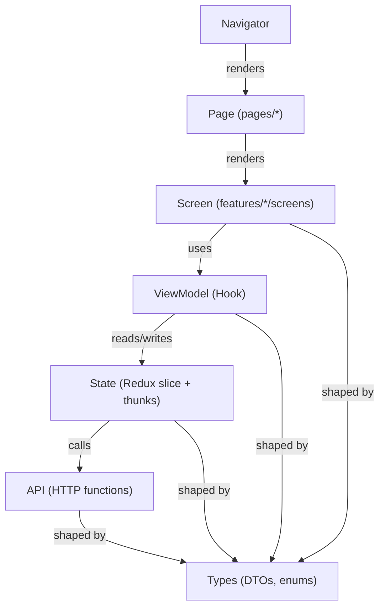

# FacePay Mobile App Plan (React Native)

This document complements [`frontend-plan.md`](./frontend-plan.md) and [`backend-plan.md`](./backend-plan.md). It records **decisions**, **dependencies**, and a **build order** for a **React Native** client that uses the **same backend** as the web app and follows the **same UI design system** (tokens, typography, components as defined in your design assets folder—not a pixel copy of DOM/CSS).

---

## 1. Goals

| Goal | Detail |
|------|--------|
| **Same product** | Full **UI + logic parity** with the web app flows investors expect to see—not a reduced “demo-only” subset unless explicitly deferred. |
| **Same backend** | Mobile is another **HTTP client** to the existing API (`backend/`). No duplicate business rules on the device except UX-necessary validation. |
| **Solo maintainability** | One mobile codebase (**iOS + Android**), favor **Expo** for tooling and iteration speed. |
| **Funding-ready** | Credible installable build (e.g. **Expo Go** early, then **internal distribution** / **TestFlight** / **Play internal testing** when needed) plus a stable **demo script**. |
| **Design consistency** | Reuse **brand + design tokens** from stored UI specs; adapt **layout and navigation** for mobile (tabs, stacks, safe areas)—not a second visual identity. |

---

## 2. Development workflow (before writing feature code)

This section records **how** work starts and how it lands in Git—follow it **before** Phase 1 in **§9** (Phases).

### 2.1 Order of operations

| Step | What to do |
|------|------------|
| **1** | **Install Expo / React Native tooling** on the host (Node LTS per Expo docs, `npx create-expo-app@latest` into `mobile/`, Android Studio / Xcode as needed for emulators or physical devices). |
| **2** | **Add npm dependencies** from **§6** (navigation, axios, state, secure storage, etc.) as each layer is needed—avoid installing the full graph blindly on day one. |
| **3** | **Establish folder structure** under `mobile/src/` per **§7** (`app/`, `pages/`, `features/*`, `shared/`): extend the Expo template with folders and minimal navigator wiring so imports match the architecture early. |
| **4** | **Implement** following **§9** (skeleton → design system → features → spikes → demo hardening). |

### 2.2 Docker

| Area | Docker? |
|------|--------|
| **`mobile/` (Metro, Expo, simulators, devices)** | **No** — run the app on the host; Docker is not the default for RN/Expo local development for this project. |
| **`backend/` (API + optional Postgres)** | **Yes (optional)** — use [`backend/docker-compose.yml`](../backend/docker-compose.yml) for a reproducible API; the simulator or device only needs a **reachable API base URL** (use LAN IP for a physical phone, not only `localhost`). |

### 2.3 Git / GitHub

- **Commit and push to GitHub after each completed phase** (e.g. Expo project boots, folder structure + navigation shell, design tokens + `shared/` primitives, each major feature).
- Keep **`mobile/.gitignore`** aligned with the Expo template (`node_modules/`, `.expo/`, build outputs, local env files). **Do not commit secrets** or production credentials.

---

## 3. Repository layout

| Decision | Choice |
|----------|--------|
| **Repo** | **Same monorepo** as `frontend/`, `backend/`, `docs/`. |
| **Location** | New top-level folder: **`mobile/`** (sibling of `frontend/`). **Do not** nest the RN app inside `frontend/`—Vite + Metro + shared `node_modules` without a workspace strategy causes avoidable pain. |
| **Optional later** | `packages/*` for shared **TypeScript types**, API DTOs, or small utilities once duplication hurts. |

---

## 4. Backend and auth

- **API:** Same base URL and REST JSON contracts as web (`frontend/src/features/*/api/*`).
- **Auth:** Align with whatever the backend and web settle on (e.g. **Bearer JWT**). On mobile, store **tokens in secure storage** (not long-lived secrets in plain AsyncStorage).
- **CORS:** Not applicable to native HTTP clients; ensure the server accepts mobile **User-Agent** / rate limits if you add them later.

---

## 5. Tech stack (decision)

| Layer | Choice | Rationale |
|-------|--------|-----------|
| **Framework** | **Expo** (managed workflow) | Fast solo iteration, sensible defaults, access to dev builds and store pipelines via **EAS** when needed. |
| **Language** | **TypeScript (strict)** | Matches `frontend/` and `backend/`. |
| **Navigation** | **React Navigation** — **native stack** + **bottom tabs** (as needed) | Replaces `react-router-dom`; maps web routes to stacks/tabs. |
| **HTTP** | **axios** | Same library as web (`frontend/package.json`); familiar interceptors for `Authorization` and 401 handling. |
| **Global state** | **@reduxjs/toolkit** + **react-redux** + **redux-persist** (recommended default) | Parity with web architecture (`frontend/src/app/store.ts`, feature slices). Alternative: **TanStack Query** for server cache + minimal local auth state—use if you want less Redux boilerplate and accept a second pattern in the monorepo. |
| **Secure storage** | **expo-secure-store** | Keychain / Keystore–backed storage for access/refresh tokens. |
| **Env** | **expo-constants** (or Expo env pattern) | API base URL and non-secret config per build profile. |

---

## 6. Dependencies (planned)

Exact versions are pinned when you run **`npx create-expo-app`** for a given **Expo SDK**; keep `mobile/` on the SDK’s supported `react-native` line.

### 6.1 Core

- `expo`
- `expo-status-bar`
- `expo-splash-screen`
- `expo-constants`
- `expo-linking` (deep links later, optional early)

### 6.2 Navigation

- `@react-navigation/native`
- `@react-navigation/native-stack`
- `@react-navigation/bottom-tabs`
- `react-native-screens`
- `react-native-safe-area-context`

### 6.3 Data and state

- `axios`
- `@reduxjs/toolkit`, `react-redux`, `redux-persist` — **if** choosing Redux parity (recommended in §5)
- `@react-native-async-storage/async-storage` — **non-sensitive** preferences only; pair with secure storage for tokens

### 6.4 Security

- `expo-secure-store`

### 6.5 Camera, QR, face (native differs from web)

Web today uses **`@vladmandic/face-api`** and **`html5-qrcode`**—these are **not** drop-in on React Native. Mobile plan:

| Web | Mobile (planned) |
|-----|------------------|
| `@vladmandic/face-api` | **Spike first:** `expo-camera` capture + backend contract unchanged, or **ML Kit / frame pipeline** (e.g. **react-native-vision-camera** + plugins) if on-device quality is required. **Do not assume** face-api.js runs unchanged in RN. |
| `html5-qrcode` | **`expo-camera`** barcode scanning (SDK-permitted APIs) or upgrade path to **vision-camera** if scan performance requires it. |
| `qrcode.react` | **`react-native-qrcode-svg`** (depends on **`react-native-svg`**) for static “my QR” display. |

### 6.6 Tooling

- **TypeScript**, **ESLint** — align with monorepo conventions when `mobile/` is wired into root workspaces (optional Phase 1).

---

## 7. Architecture: MVVM + feature-based

Match [`frontend-plan.md`](./frontend-plan.md): each **feature** is a self-contained folder; **screens** and **components** are the **View**, **viewModel** hooks connect **View** to **Model** (Redux slice + thunks or equivalent), **api** is the HTTP boundary, **types** hold DTOs and state shapes.

**Pages (route shell):** same idea as [`frontend/src/pages/`](../frontend/src/pages/)—**`src/pages/<route>/`** holds one **Page** component per registered route (e.g. `LoginPage.tsx`). Pages are **thin**: they render the feature **`screens/`** implementation and may add route-only wrappers (error boundaries, suspense, analytics). **Navigators import Pages, not raw feature screens**—keeps navigation wiring separate from feature internals.

### 7.1 MVVM mapping (React Native)

| MVVM role | Folder | Responsibility |
|-----------|--------|----------------|
| **Page (route entry)** | `pages/<route>/` | Thin screen registered in React Navigation; composes one feature **`screens/*`** entry (mirrors web `*Page.tsx`). |
| **View** | `screens/`, `components/` | RN UI only: layout, styles, user input. No orchestration of API or global rules beyond presentation. |
| **ViewModel** | `viewModel/` | Hooks such as `useAuthViewModel`: select state, dispatch thunks / actions, expose loading and error flags for screens. |
| **Model** | `state/` | Redux `createSlice` + async thunks calling `api/` (or equivalent store layer). |
| **Data access** | `api/` | `axios` functions only; no JSX. |
| **Contracts** | `types/` | Interfaces, enums, DTOs—shared by api, state, viewModel, and View. |

**Data flow** (same idea as web):



If you later adopt **TanStack Query** for server cache, keep MVVM: **viewModel** wraps `useQuery` / `useMutation` and exposes a stable interface to **screens**; **state/** shrinks to client-only concerns (e.g. session flags) where needed.

### 7.2 Per-feature folder set (six folders — parity with web)

Every feature under `src/features/<name>/` uses the same six folders as `frontend/src/features/*`:

1. **`types/`** — TypeScript interfaces, enums, DTOs for that feature  
2. **`api/`** — API call functions (isolated HTTP)  
3. **`state/`** — Redux slice + async thunks that call `api/`  
4. **`viewModel/`** — Custom hooks: `useAppSelector` + `dispatch` (or query wrappers)  
5. **`components/`** — Reusable presentational pieces for that feature  
6. **`screens/`** — Full screen components: compose `components/` + `viewModel/`  

**`pages/`** (alongside `features/`, not inside each feature): one folder per **registered route** (aligned with web `pages/login`, `pages/home`, etc.). Each file exports `XxxPage` and returns the matching feature screen. **Feature modules stay self-contained;** navigators depend on **`pages/`** only.

**Rule:** product-specific **logic and UI implementation** live under **`features/<name>/`**. **Route entry files** live under **`pages/`**. Cross-cutting infrastructure lives under **`shared/`** (see below).

### 7.3 `mobile/` folder structure (canonical)

Expo config files (`app.config.ts` / `app.json`, `package.json`, `tsconfig.json`) live at **`mobile/`** root; application source under **`mobile/src/`**.

```
mobile/
  app.config.ts                 # Expo config (and/or app.json)
  package.json
  tsconfig.json
  src/
    app/
      App.tsx                   # Root: providers + NavigationContainer
      store.ts                  # configureStore; persistor if using redux-persist
      rootReducer.ts            # combine feature reducers / slices
      navigation/
        RootNavigator.tsx       # Auth stack vs App stack (mirrors web guards)
        types.ts                # React Navigation ParamList types
      providers/
        AppProviders.tsx        # Redux, theme, safe area, etc.

    pages/                      # route shells — imported by navigators (parity with frontend/src/pages)
      login/
        LoginPage.tsx           # e.g. renders features/auth/screens/LoginScreen
      signup/
        SignupPage.tsx
      home/
        HomePage.tsx
      registerFace/
        RegisterFacePage.tsx
      faceVerification/
        FaceVerificationPage.tsx
      verificationFailed/
        VerificationFailedPage.tsx
      selectRecipient/
        SelectRecipientPage.tsx
      enterAmount/
        EnterAmountPage.tsx
      reviewPayment/
        ReviewPaymentPage.tsx
      successReceipt/
        SuccessReceiptPage.tsx
      history/
        HistoryPage.tsx
      myQrCode/
        MyQRCodePage.tsx
      scanQr/
        ScanQRPage.tsx
      profile/
        ProfilePage.tsx

    features/
      auth/
        types/
        api/
        state/
        viewModel/
        components/
        screens/
      home/
        types/
        api/
        state/
        viewModel/
        components/
        screens/
      wallet/                   # if split from home on mobile; align with web features
      send/
        types/
        api/
        state/
        viewModel/
        components/
        screens/
      faceAuth/
        types/
        api/
        state/
        viewModel/
        components/
        screens/
      history/
        types/
        api/
        state/
        viewModel/
        components/
        screens/
      receive/
        types/
        api/
        state/
        viewModel/
        components/
        screens/
      profile/
        types/
        api/
        state/
        viewModel/
        components/
        screens/

    shared/
      api/
        client.ts               # axios instance, base URL, interceptors (401, token attach)
      theme/
        colors.ts
        spacing.ts
        typography.ts           # align with design tokens / frontend-plan
      components/               # generic primitives only (Screen, AppButton, Spinner)
        Screen.tsx
      navigation/               # optional: small guard helpers; avoid business logic here
      utils/
      types/                    # optional: truly global types only
```

Name features to **mirror web** (`auth`, `home`, `faceAuth`, `send`, `history`, `receive`, `profile`, `wallet`) even if one feature is merged into a tab on mobile—keep **api/state/types** boundaries clear.

### 7.4 Navigation vs MVVM

- **React Navigation** navigators live under **`src/app/navigation/`**. They **register** **`pages/*`** components (`component={LoginPage}` or equivalent) and route params; they should **not** own business rules.
- **Pages** live under **`src/pages/<route>/`** and delegate to **`src/features/*/screens/`**. Business flow and side effects go through **viewModel** → **state** → **api** inside the feature.

---

## 8. Web route parity (acceptance checklist)

Map **`frontend/src/app/router.tsx`** paths to RN stacks and **`src/pages/*`** entries (one Page per route, mirroring web). Guards: **guest** (login/signup) vs **authenticated** (rest).

| Web path | Feature | Notes |
|----------|---------|--------|
| `/login` | Auth | Guest guard |
| `/signup` | Auth | Guest guard |
| `/` | Home | Auth guard |
| `/register-face` | Face auth | Camera / permissions spike |
| `/send` … `/send/success` | Send money | Multi-step stack |
| `/send/verify`, `/send/verify/failed` | Face verification | Tied to send flow |
| `/history` | History | |
| `/receive`, `/receive/scan` | Receive | QR display + scan |
| `/profile` | Profile | |

**Definition of done (per screen):** same **loading / empty / error / success** states as web, not only the happy path.

---

## 9. Phases (before heavy UI polish)

### Phase 0 — Decisions

- Expo SDK / `create-expo-app` template (**tabs** optional).
- Redux vs TanStack Query (default: **Redux parity**).
- Token storage rules (what persists, what never hits AsyncStorage).

### Phase 1 — Skeleton

- `mobile/` app runs on a **physical device**.
- Root navigation: **Auth** vs **App** (mirrors `GuestGuard` / `AuthGuard`).
- **One authenticated API call** to the real backend (smoke test).

**Status (initial scaffold):** `mobile/` exists with Expo SDK 54, `src/app` (store, navigation, providers), `src/pages/*` (thin shells + placeholders), `src/features/auth` + `home`, `shared/api` + `config`, `GET /health` on Home, Redux + persist for `auth`, `babel-plugin-module-resolver` alias `@/` — see [`mobile/README.md`](../mobile/README.md).

### Phase 2 — Design system

- Theme from stored design tokens (colors, radii, spacing, typography).
- Primitives: `Screen`, text styles, primary button, input, card.

**Status:** `src/shared/theme/` (`colors`, `spacing`, `radii`, `shadows`, `typography`, `theme`, `ThemeContext`) mirrors web Tailwind palette; **Manrope** loaded in `FontLoader`; primitives in `src/shared/components/` — **`Screen`**, **`AppText`**, **`AppButton`**, **`AppTextField`**, **`Card`**; Login / Signup / Home / placeholders consume them. **`expo-font`** plugin added in `app.json`.

### Phase 3 — Feature build order

1. Login / Signup  
2. Home  
3. Profile  
4. History  
5. Receive (QR display + scan)  
6. Send (full stack)  
7. Face registration + verification (after camera/QR spikes)

**Status (steps 1–2):** Real **`/api/v1/auth/login`**, **`/signup`**, **`/logout`** with JWT in **Expo SecureStore** (not Redux); **`bootstrapSessionThunk`** restores session via **`GET /api/v1/me`** before navigation; axios attaches Bearer from SecureStore and clears session on **401**. **Home** loads **`GET /api/v1/me/wallet/balance`** + **`GET /api/v1/me/transactions?limit=5`** with pull-to-refresh. Redux **persist whitelist** is `home` + `wallet` only (auth is not persisted). See `mobile/src/features/auth/*`, `home/*`, `wallet/*`, `shared/lib/authTokenStorage.ts`, `shared/api/client.ts`.

### Phase 4 — Spikes (early)

- **QR** scan + **my QR** generation on device.  
- **Face** capture path that satisfies backend contracts (may differ from web’s face-api implementation).  
- **Secure auth** end-to-end.

### Phase 5 — Funding hardening

- Short **demo script** + screen recording fallback.  
- Internal / TestFlight / Play internal track when “installable app” matters.  
- Minimal **crash reporting** before live investor demos.

---

## 10. Optional monorepo follow-up

When sharing types or API wrappers between `frontend/` and `mobile/`:

- Add root **npm/pnpm/yarn workspaces**.
- Introduce `packages/shared-types` or similar—only when duplication becomes costly.

---

## 11. References in this repo

| Resource | Path |
|----------|------|
| Web routes + guards | `frontend/src/app/router.tsx` |
| Web pages (route shells) | `frontend/src/pages/*` |
| Web features | `frontend/src/features/*` |
| Web HTTP stack | `frontend/package.json` (axios, RTK, persist) |
| Backend plan | [`backend-plan.md`](./backend-plan.md) |
| Frontend plan | [`frontend-plan.md`](./frontend-plan.md) |

---

## 12. Open items (track as you build)

- [ ] Final choice: **Redux only** vs **TanStack Query** (if deviating from §5).  
- [ ] Face pipeline: **expo-camera + server** vs **on-device ML** (post-spike).  
- [ ] EAS project + credentials when moving beyond Expo Go.  
- [ ] Root **workspace** config for optional `packages/*`.
